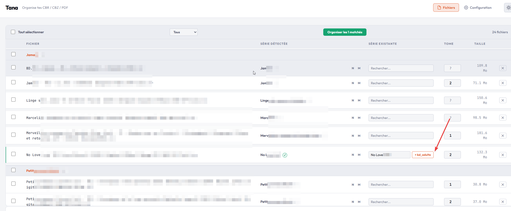
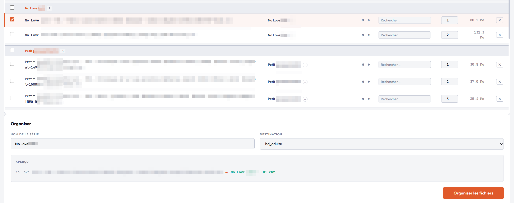

# Tana - File Organizer (CBZ/CBR/PDF)

> **Tana** (棚) signifie "étagère" en japonais. Comme son nom l'indique, Tana range vos fichiers sur la bonne étagère.

Outil web pour organiser automatiquement une collection de manga et BD (CBR, CBZ, PDF) depuis un dossier d'import vers des destinations catégorisées.

## Aperçu


*Vue principale : les fichiers sont analysés automatiquement. Tana détecte le nom de série, propose un matching avec les séries existantes, et permet de rechercher manuellement une correspondance.*


*Organisation : les fichiers sont groupés par série détectée. Le panneau du bas permet de choisir le nom de série, la destination, et affiche un aperçu du renommage avant validation.*

## Fonctionnalités

- **Détection automatique** du nom de série et du numéro de tome depuis le nom de fichier
- **Matching intelligent** avec les séries existantes (normalisation accents/articles, scoring multi-critères)
- **Organisation batch** : un clic pour ranger tous les fichiers auto-matchés
- **Groupement visuel** par série détectée avec sélection de groupe
- **Tri et filtres** par nom, taille, tome, statut de match
- **Recherche** dans les séries existantes avec autocomplétion et navigation clavier
- **Renommage standardisé** : `Nom Série - T01.cbr`
- **Liens externes** vers Nautiljon et Manga-News pour vérification
- **Thème** dark / light
- **Page de configuration** pour gérer le dossier source et les destinations depuis l'interface

## Stack

- **Backend** : Python / Flask
- **Frontend** : Vanilla JS + HTML + CSS (pas de framework)
- **Base de données** : aucune (filesystem uniquement)

## Installation

```bash
python -m venv venv
source venv/bin/activate
pip install -r requirements.txt
```

## Configuration

La configuration est stockée dans `config.json` à la racine du projet (créé automatiquement au premier lancement avec des valeurs par défaut) :

```json
{
  "source_dir": "/chemin/vers/dossier/incoming",
  "destinations": [
    "/chemin/vers/bd",
    "/chemin/vers/manga"
  ]
}
```

Elle est aussi modifiable directement depuis l'onglet **Configuration** dans l'interface web.

## Lancement

```bash
python app.py
```

L'interface est accessible sur `http://localhost:9045`.

## Matching

Le système de matching utilise un scoring multi-critères :

| Score | Niveau | Description |
|-------|--------|-------------|
| 1.0 | Exact | Nom identique (case-insensitive) |
| 0.95 | Normalisé | Identique après suppression accents, articles, ponctuation |
| 0.7 | Préfixe | Un nom est préfixe de l'autre (ex: "Dragon Ball" / "Dragon Ball Super") |
| 0.6-0.8 | Tokens | 80%+ des mots en commun |

- Score >= 0.9 : match automatique (badge vert)
- Score 0.6-0.9 : suggestion (badge jaune, confirmation manuelle)
- Score < 0.6 : pas de match

## Formats supportés

`.cbr` `.cbz` `.pdf`
